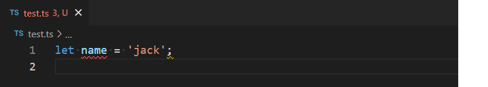
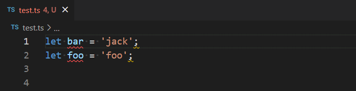

  

Insert `eslint-disable` directive comment with present problem rules for VS Code.

## Features
Select single or **multiple lines** which have rule problems from the extension of ESLint IntelliSense, and it could either disable rules for lines by `ctrl + alt + d` or disable for the entire file by `ctrl + alt + e`.

> **Note**
> 
> It doesn't need to select all text of lines. See preview below.

## Preview

For single line.

For multiple lines, press `ctrl + d` to select another pair in other side.

## TODO

- [ ] Support multi-selections disable at the same action.
